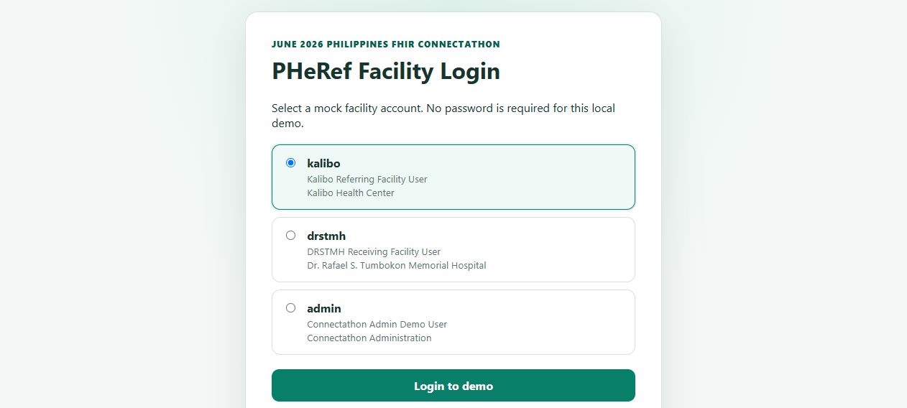
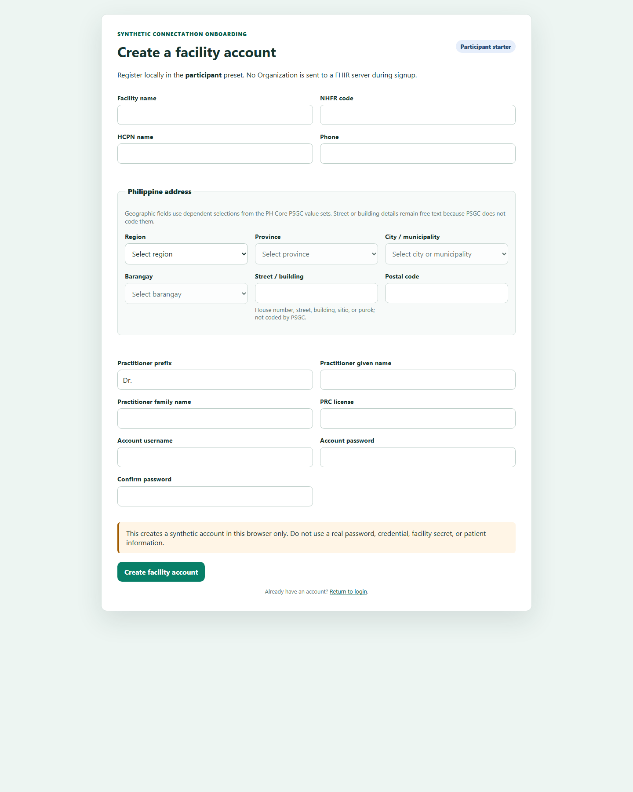

# Local EMR eReferral Mock

[](https://github.com/jldalisay95/ereferral-mock-connecthathon/actions/workflows/ci.yml)
[](LICENSE)

A React and TypeScript facility workflow demo for the June 2026 Philippines
FHIR Connectathon. It demonstrates local patient registration, referral
creation, PHeRef Bundle validation and guarded submission, receiving-facility
response, notifications, tracking, timeline review, and printing.

This is a Connectathon mock, not a production EMR. Use synthetic data only.

## Choose a track

This repository has one implementation and two build presets. A fresh clone is
safe by default.

| Track | Command | What it permits |
|---|---|---|
| Participant Starter (default) | `npm run dev` | Remote reads, terminology, Bundle preview, and `$validate`; all external writes are blocked at the FHIR client boundary |
| Connectathon Ready | `npm run dev:ready` | Validated Organization publishing plus the send, receive, and Task-update workflow after successful non-blocking validation |

| Configuration task | Participant Starter | Connectathon Ready |
|---|---|---|
| Browser endpoint override | Public **Participant Setup** page | Admin **Settings** |
| Mode-specific endpoint file | `.env.participant.local` | `.env.ready.local` |
| Profiles, identifiers, ValueSets, and PSGC | `src/config/connectathon.config.ts` | The same tracked configuration |
| External writes | Always blocked | Guarded by validation and ready capabilities |

Connectathon Ready requires successful live `$expand` responses for configured
FHIR and PSGC ValueSets. It never substitutes bundled terminology. All
terminology requests are read-only; the app does not modify CodeSystem or
ValueSet resources on the terminology server.

Do not change branches to graduate. Fork the repository, edit
[`src/config/connectathon.config.ts`](src/config/connectathon.config.ts), use the
in-app **Connectathon Guide**, and explicitly restart with the ready command.
The preset is build configuration and cannot be enabled by a stored `demoMode`.

Guides:

- [Participant fork, configure, and validate](docs/PARTICIPANT_STARTER.md)
- [Ready send and receive workflow](docs/CONNECTATHON_READY.md)
- [Configuration-to-FHIR/IG mapping](docs/IG_MAPPING.md)

## Source of truth

- [PHeReF Implementation Guide](https://build.fhir.org/ig/ph-ereferral-organization/ph-ereferral/en/)
- [PHeReF Referral Workflow](https://build.fhir.org/ig/ph-ereferral-organization/ph-ereferral/en/referral-workflow.html)
- [PHeReF Logical Information Model](https://build.fhir.org/ig/ph-ereferral-organization/ph-ereferral/en/logical-information-model.html)
- [June 2026 Connectathon repository](https://github.com/UPM-NTHC/June-2026-Philippines-FHIR-Connectathon)
- [Connectathon acceptance criteria](https://docs.google.com/spreadsheets/d/1Z5k79KtCGaK5sJ5h9yKbku5epo10e-jmrLpsPp3-z4U/edit?gid=1488466081#gid=1488466081)

The generated Bundle follows the v0.1 profiles currently loaded by the
Connectathon validation server:

- Referral category: `ServiceRequest.category` using Emergency or Outpatient
- Urgency: `ServiceRequest.priority`
- Requested service: `ServiceRequest.code`
- Service type compatibility: `ServiceRequest.reasonCode`
- Clinical reason: coded Condition referenced by `ServiceRequest.reasonReference`
- Time called: draft mapping to `ServiceRequest.occurrenceDateTime`

## Install and run

Requirements: Node.js 20 or later and npm.

```powershell
git clone https://github.com/jldalisay95/ereferral-mock-connecthathon.git
cd ereferral-mock-connecthathon
npm install
npm run dev
```

Open `http://localhost:5173`.

In Participant Starter, select **Configure Participant Starter** before login.
The public setup page explains each endpoint, saves browser-local URL overrides,
and runs read-only metadata, profile, terminology, and PSGC checks. After the
checks, continue to local facility registration or sign in with a bundled account.

Endpoint environment overrides are optional. Copy `.env.example` to
`.env.participant.local` or `.env.ready.local` and edit only the URLs you need.
Never put secrets in `VITE_*` values because Vite exposes them to the browser.

## Demo accounts

All accounts use password `demo123`.

| Username | Facility | Role |
|---|---|---|
| `kalibo` | Kalibo Health Center | Facility user |
| `drstmh` | Dr. Rafael S. Tumbokon Memorial Hospital | Facility user |
| `southcotabato` | South Cotabato Demo Facility | Facility user |
| `admin` | Connectathon Administration | Read-all and endpoint configuration |

Credentials and browser sessions are mock data stored locally. They do not
provide production authentication or authorization.

## Create your own facility

From the login page, select **Create a facility account** in either preset.
Enter synthetic facility, practitioner, PSGC address, username, and password
values. The facility and account are saved together in this browser and the new
account is signed in automatically. Signup never sends a FHIR write.

In the participant preset, the local facility remains usable while all external
writes stay locked. In the ready preset, open **Connectathon Guide** and choose
**Validate and publish Organization**. The app asks for confirmation, calls
`Organization/$validate`, and sends an idempotent NHFR conditional transaction
only when validation has no blocking issues. A failed validation or network
request does not remove the local account.

Passwords are stored in browser-local demonstration state. Never reuse a real
password or enter real facility secrets or patient data.

## Screenshots





## Contextual facility behavior

Facility roles are determined per referral:

- The logged-in facility is the initiating facility when its organization ID
  matches `referringOrganizationId`.
- The same facility is the receiving facility when its organization ID matches
  `receivingOrganizationId`.
- Facility users can therefore have records in both Sent Referrals and Incoming
  Referrals.
- Only the receiving facility for a referral can record receiving responses or
  care status updates.

Admin can review all local records but cannot perform facility workflow actions.

## Referral demonstration

### Send a referral

1. Sign in as `kalibo`, `drstmh`, or `southcotabato`.
2. Open Patient Registry to search, add, or update a synthetic patient.
3. Open Generate Referral and select a patient.
4. Record assessment details and confirm that local referral criteria are met.
5. Record local patient or representative consent.
6. Select another facility as the receiving destination.
7. Review category, priority, requested service, clinical reason, time called,
   notes, practitioners, and signature placeholder.
8. Preview and validate the generated transaction Bundle.
9. In the participant preset, inspect the validation and JSON. In the ready
   preset, submit only after validation succeeds.

### Receive and update a referral

1. Sign out and sign in as the selected receiving facility.
2. Open Incoming Referrals. New records are highlighted and have an unread
   notification.
3. Open the referral to acknowledge the notification.
4. Review patient, routing, clinical, Task, timeline, and raw FHIR information.
5. Select a receiving response or care status and enter required remarks.
6. Submit the update and sign back into the initiating facility to see the new
   status and notification.

Supported receiving responses:

- received
- accepted
- rejected
- referred-onward

Supported local care states:

- arrived
- admitted
- ER observation
- other care
- discharged

Care states do not define a new PHeReF code system. Arrived, admitted, ER
observation, and other care map to `Task.status = in-progress`. Discharged and
workflow closure map to `Task.status = completed`. The most recent PHeReF
receiving response remains in `Task.businessStatus`.

## Patient Registry and walk-ins

The registry is local and facility-scoped. It supports searches by first name,
last name, birth date, PhilSys ID, and PhilHealth ID. Duplicate warnings use
identifiers and name plus birth date.

Walk-in records can use a temporary name and unknown demographics. They can
later link to a full local profile. Because the current ERefPatient profile
requires patient name, administrative gender, and birth date, incomplete
walk-in records cannot be submitted as an eReferral.

## Logical information model

The UI and local data model follow the PHeReF logical groups:

- Patient identity: Patient Registry, referral summary, and `Patient`.
- Sending context: logged-in facility, practitioner, PractitionerRole, and
  `ServiceRequest.requester`.
- Receiving context: selected facility and `ServiceRequest.performer` or
  `Task.owner`.
- Referral request: referral category, priority, requested service, date, time called,
  and notes on `ServiceRequest`.
- Clinical reason and context: Condition, Observation, Procedure, and
  `ServiceRequest.reasonReference` or `supportingInfo`. The requested service
  is also repeated in `reasonCode` for compatibility with the active v0.1
  validator binding.
- Workflow and response: Task status, business status, notifications, and
  timeline.
- Audit and provenance: Provenance, `ServiceRequest.relevantHistory`, actor,
  timestamp, and synthetic signature placeholder.

Consent and the referral-criteria decision are local metadata because PHeReF
v0.1 does not define a formal mapping for them.

## FHIR transaction behavior

The Bundle uses matching `urn:uuid` references.

Reusable resources use conditional PUT when a stable identifier is available:

- Patient
- Practitioner
- PractitionerRole
- Organization

Patients without PhilSys or PhilHealth identification use POST. Event resources
use POST:

- ServiceRequest
- Encounter
- Condition
- Observation
- Procedure
- DiagnosticReport
- Task
- Provenance

DiagnosticReport carries synthetic attachment metadata but is not referenced by
`ServiceRequest.supportingInfo`, because the current profile does not permit
DiagnosticReport at that path.

## Validation and endpoints

Tracked fork defaults are in `src/config/connectathon.config.ts`. The public
Participant Setup page may override only these endpoint values in the starter
track; Admin Settings provides the existing browser override in the ready track:

```dotenv
VITE_PHEREF_BASE_URL=https://cdr.pheref.fhirlab.net/fhir
VITE_PHCORE_BASE_URL=https://cdr.phcore.fhirlab.net/fhir
VITE_TX_BASE_URL=https://tx.fhirlab.net/fhir
```

Bundle validation uses `POST {PHeReF CDR}/Bundle/$validate`. The app parses
`OperationOutcome.issue.severity`; fatal and error issues are blocking, while
warning and information issues are non-blocking. HTTP 200 alone is not treated
as successful validation.

The participant preset is the default. It permits metadata, terminology,
search, preview, and validation calls, while transaction POST, resource PUT or
PATCH, facility-registration writes, and Task updates are denied by the FHIR
service boundary. `$validate` remains permitted because it is non-mutating.

The ready preset enables the workflow capability, but a referral still cannot
be submitted until the latest `$validate` result is non-blocking. Admin may use
Demo mode for local workflow simulation only while the ready preset is active.

In both presets, configured terminology fields and PSGC addresses are populated
only from live `ValueSet/$expand` responses. Failed or empty expansions block
the affected registration, patient, or referral action. The application does
not provide bundled terminology or PSGC fallback choices.

Each entry in `CONNECTATHON_CONFIG.terminology.valueSets` also declares an
`endpoint`: `pherefBaseUrl`, `phCoreBaseUrl`, or `terminologyBaseUrl`. This lets
one ValueSet expand from the PHeRef CDR while another expands from the dedicated
terminology server. The `canonical` continues to identify the ValueSet and must
not be replaced with the server URL. The Terminology Check and Connectathon
Guide show the effective source used by every configured ValueSet.

To edit source configuration, search `src/config/connectathon.config.ts` for
`EDIT FOR YOUR FORK`. Change `ig.*`, `profiles.*`, `extensions.*`,
`identifierSystems.*`, `terminology.valueSets`, and `psgc.*` only when the
active Connectathon IG or test lead supplies replacement values. Browser setup
does not edit these conformance canonicals.

## Notifications, timeline, and print

Submitting a referral creates an unread notification for the receiving
facility. Receiving-side updates create a notification for the initiating
facility. Notifications persist in localStorage and are limited to the current
browser profile.

The timeline records assessment, criteria, consent, draft creation, validation,
submission, receiving responses, care states, closure, and update failures.

Every referral detail page links to a browser print view containing patient,
routing, clinical, consent, status, and synthetic signature information.

## Quality checks

```powershell
npm run lint
npm run test
npm run build
npm run build:ready
```

Vitest is limited to tests under `src/` and excludes generated or tool-managed
directories such as `.trunk`, `dist`, and `artifacts`.

## Known limitations

- PHeReF and PH Core remain draft specifications.
- Back-referral is not implemented for the v0.1 workflow.
- Referred-onward records an outcome and destination but does not automatically
  create a replacement ServiceRequest.
- Consent is local metadata and is not a formal FHIR Consent profile.
- Attachment security and complete exchange behavior are not implemented.
- Final facility and network identification policy remains outside this demo.
- Non-response, SLA, transport, production security, and policy endorsement are
  out of scope.
- Notifications are not delivered across browsers or devices.
- The signature is a synthetic Provenance placeholder, not a cryptographic
  signature.
